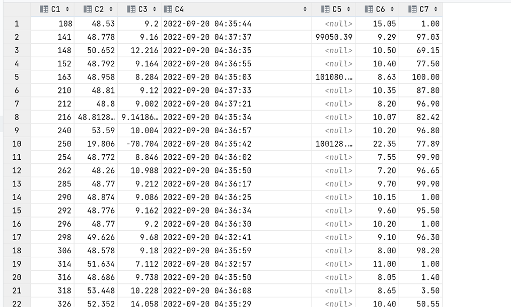
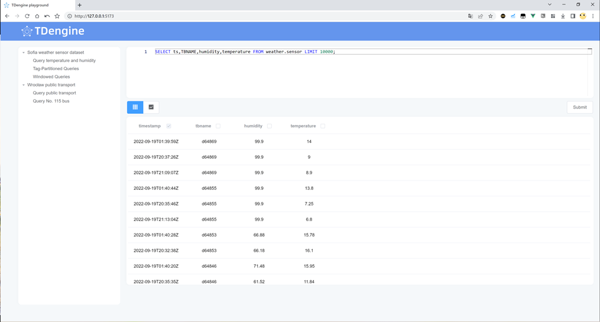
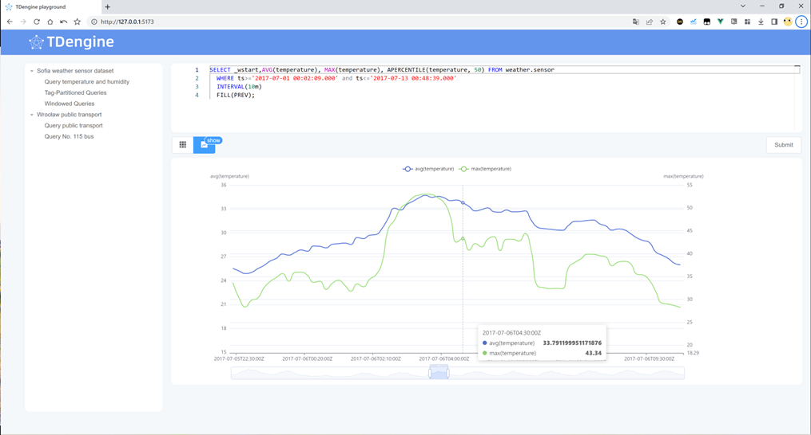
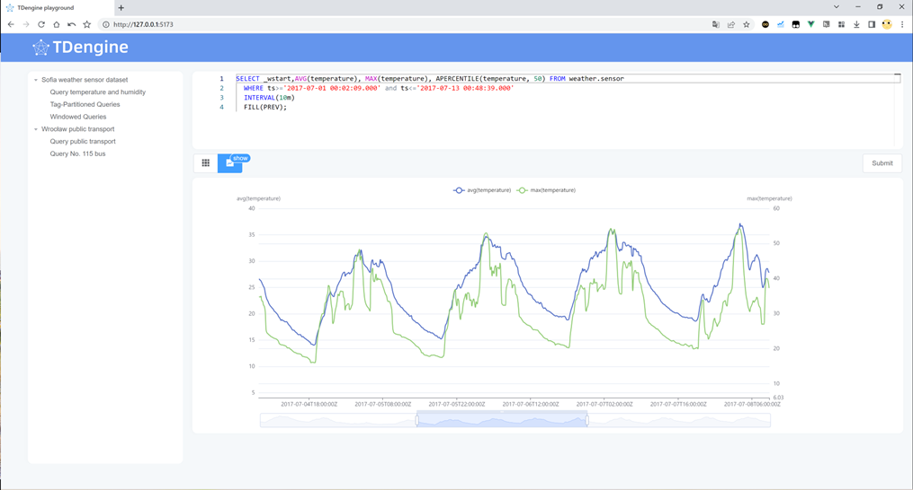

# tdengine-playground
**数据同步导入环境为Ubuntu**
### 1.	主要软件、框架及依赖：
TDengine3、Vue3、Python3、Vite、ECharts、Element Plus、Monaco Editor
### 2.	项目设计
首先通过python脚本对数据集进行处理然后通过TDengine Python Connector taospy将数据集导入TDengine中。之后使用Vue和Vite构建前端, 使用Element Plus组件组织页面，Monaco作为前端的SQL编辑器，ECharts渲染图表。前端通过taosAdapter 提供的 REST 接口与TDengine服务端建立连接，不需要单独的后台。

### 4.	TDengine修改配置

需要修改WAL 来防止插入大量数据出错

需要配置taosAdapter 跨域参数

### 3.	所选数据集及建模信息
所选数据均满足公开获取要求

A.	选择用索菲亚地区的天气传感器数据作为数据集来进行建模
传感器数据时间为秒级，选取经纬度作为模型的标签,传感器的ID为表名。数据分为存档数据和同步数据，数据通过import_data.py导入，导入存档和同步数据需要修改小部分代码（已注释）。使用pull_data.py拉取和存储同步数据，同步数据请求连接：[https://api.luftdaten.info/static/v2/data.temp.min.json]()，数据每五分钟更新一次。拉取的数据暂时以csv文件的形式保存在sync_data文件夹中，使用import_data.py导入到TDengine。

1. 字段名	中文	类型	长度	注释
2. sensor_id	传感器ID			仅作为table_name
3. ts	时间戳	TIMESTAMP	8
4. pressure	气压	DOUBLE	8
5. temperature	温度	FLOAT	4
6. humidity	湿度	FLOAT	4
7. lat	纬度	FLOAT	4	TAG
8. lon	经度	FLOAT	4	TAG

数据库建模语句：
`CREATE DATABASE weather`

`CREATE STABLE weather.sensor (ts TIMESTAMP, pressure DOUBLE,temperature float,humidity float) TAGS (lat float, lon float)`

`INSERT INTO ? USING sensor TAGS(?, ?) VALUES(?, ?, ?, ?)`
采用插入时自动建表的方式 ？为占位符

B.	第二个数据集为弗罗茨瓦夫公共交通，数据只有存档数据
字段名	中文	类型	长度	注释
line_number	公交序号			作为table_name和TAG
ts	时间戳	TIMESTAMP	8	
type	公共交通类型	NCHAR(10)	10	
vehicle_id	车辆ID	INT	4	
latitude	纬度	FLOAT	4	TAG
longitude	经度	FLOAT	4	TAG
数据库建模语句：
CREATE DATABASE transport
CREATE STABLE transport.gps (ts TIMESTAMP,type nchar(10),latitude float,longitude float, vehicle_id int) TAGS (line_number nchar(10))

6.	### 前端配置
1)	TDengine RESTful API 的认证信息，直接修改authorization变量，TOKEN 为 {username}:{password} 经过 Base64 编码之后的字符串，例如 root:taosdata 编码后为 cm9vdDp0YW9zZGF0YQ==。
2)	内置SQL语句直接修改preset_sql变量。

### 7.	预览

